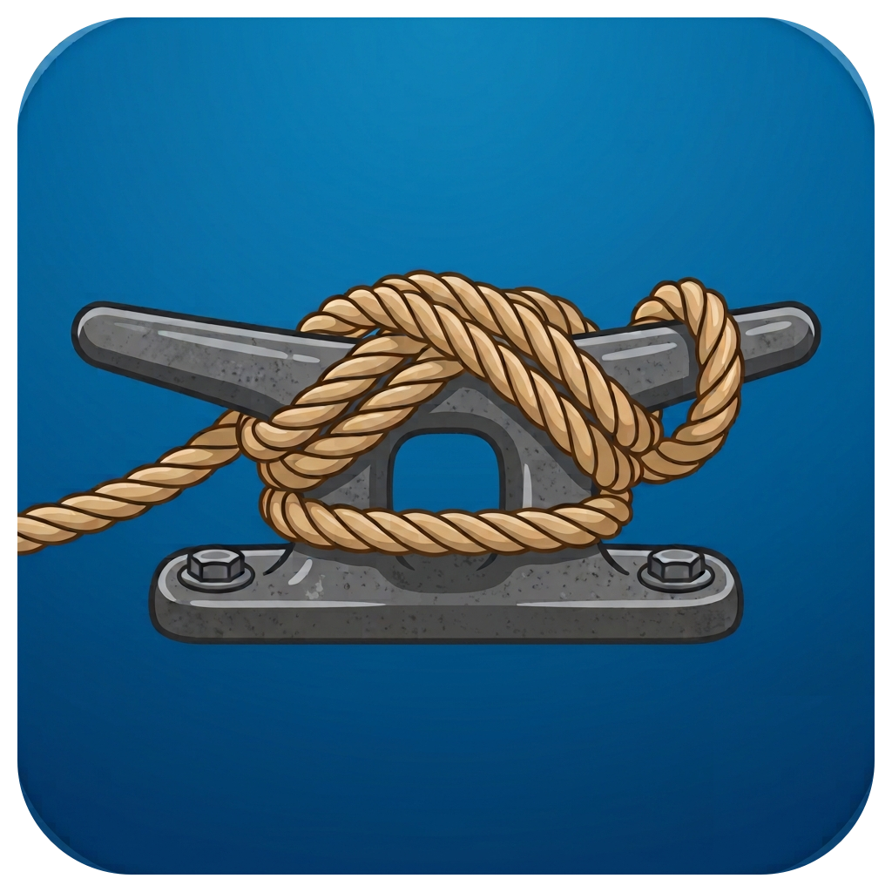

<p align="center">
  
</p>

<h1 align="center">Moorage</h1>

<p align="center">Mount Android and other MTP devices in Finder. Small, fast, silent.</p>

Moorage is a macOS menu bar app that mounts MTP devices (Android phones, tablets, cameras, e-readers) as real Finder volumes. Plug in, unlock the device, and it appears under ~/Moorage and in Finder. No transfer window, no drivers, no kernel extensions, no system extensions to approve.

## Why

macOS has no native MTP support. The existing options are transfer-window apps (Android File Transfer, OpenMTP) that make you work inside their UI. Moorage takes the other road: a real mounted volume, served by a private in-process WebDAV bridge and mounted with macOS's own mount_webdav, with nothing on screen but a menu bar item.

## Status

Working: mounts, browses, and reads verified against a real Kindle Paperwhite; 50 protocol self-checks green; full mount path testable with no device via the in-memory backend. Writes verified on a Kindle Paperwhite (paste, rename, delete, mkdir). See [docs/DESIGN.md](docs/DESIGN.md) for architecture and [docs/PITFALLS.md](docs/PITFALLS.md) for the graveyard of the two Apple-extension architectures that preceded this one.

## Requirements

- macOS 26 or later
- Apple Silicon or Intel
- A device that speaks MTP, set to File Transfer mode

## Design goals

1. **Real mount.** A volume in Finder, browsable like any drive, bytes fetched from the device on demand.
2. **Small.** Pure Swift, zero third-party dependencies, tiny binary.
3. **Fast.** Metadata cached on connect, async enumeration, never blocks Finder on a device round-trip. MTP's wire speed is the only ceiling.
4. **Silent.** Launches at login, lives in the menu bar, one menu: Mount/Eject, Show in Finder, Launch at Login, Quit.

## Building

SwiftPM plus build scripts, no Xcode project.

```
Scripts/build-app.sh            # build + sign dist/Moorage.app
Scripts/build-app.sh --install  # also install to /Applications and launch
swift run MoorageSelfCheck      # protocol tests, no device needed
```

## License

MIT. See [LICENSE](LICENSE).
